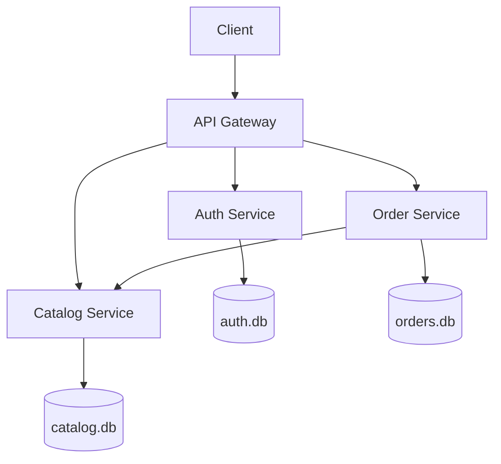

# Monolith refactored into microservices

This project implements the same functions as the provided monolith using four independent FastAPI services:

| Service | Port | Responsibility | Database |
|---|---:|---|---|
| API Gateway | 8000 | Public API and request routing | — |
| Auth Service | 8001 | Register, login, token verification, logout | `auth.db` |
| Catalog Service | 8002 | Add and view products | `catalog.db` |
| Order Service | 8003 | Add and view the current user's orders | `orders.db` |

The Order Service calls the Catalog Service before creating an order. The Gateway calls the Auth Service to validate every protected request. Thus, the services communicate over HTTP and do not share one database.

## Quick start (Windows, macOS or Linux)

Use Python 3.10 or newer. Open a terminal in this folder and run:

```bash
python -m venv .venv
```

Activate the environment on Windows:

```powershell
.venv\Scripts\activate
```

On macOS/Linux:

```bash
source .venv/bin/activate
```

Install packages and start all services:

```bash
python -m pip install -r requirements.txt
python start_all.py
```

Open **http://127.0.0.1:8000/docs**. All user actions can be tested from this single Gateway page.

## Testing order in Swagger

1. `POST /auth/register` — create a user.
2. `POST /auth/token` — copy `access_token` from the response.
3. For protected requests, add the header `Authorization: Bearer <access_token>`.
4. `POST /catalog/products` — add a product (price is in cents).
5. `GET /catalog/products` — view products.
6. `POST /orders` — create an order using the product ID.
7. `GET /orders` — view the logged-in user's orders.
8. `POST /auth/logout` — invalidate the token.

You can also check the full flow automatically in a second terminal:

```bash
python verify_flow.py
```

Expected result:

```text
SUCCESS: register, login, products, orders and logout all work.
```

## Architecture



For an educational project, the default JWT secret is included in the code. In a deployed system, set the `JWT_SECRET` environment variable to a private value and restrict direct access to internal services.

